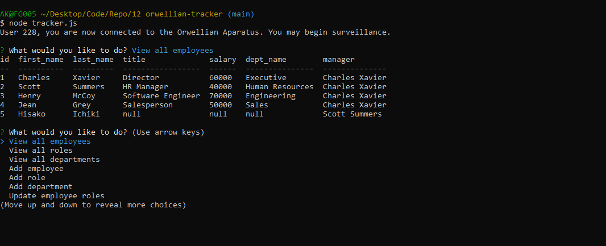

# Orwellian Tracker  [](https://opensource.org/licenses/MIT) 
###### This readme has been procedurally generated 

-----------------------
## Table of Contents
1. [Description](#description)
2. [Deployed link](#deployed-link)
3. [Installation](#installation)
4. [Usage](#usage)
5. [Licenses](#licenses)
6. [Contributing](#contributing)
7. [Tests](#tests)
8. [Questions](#questions)

-----------------------
## Description
Managing a company's employees can be a difficult task. But not anymore! With the Orwellian Tracker you can manage your employees with ease. You can add employees, roles, and departments and assign relationships between the three.



-----------------------
## Deployed link
https://github.com/akhalid88/orwellian-tracker

-----------------------
## Installation
To install dependencies run the following command:
```
npm install
```

-----------------------
## Usage
To use this repo you will need a working knowledge of Javascript, Node JS, and mySQL. 

To run this tool use the following command. This will generate a markdown file in the root folder with the name of 'READMETOO.md'

```
node tracker.js
```
-----------------------
## Code snippets

This project taught me a lot about SQL. The most interesting bit of SQL query that I performed was my request to view all employees. I wanted to obtain the employee info along with their role and department info. This was easy enough with a couple of **LEFT JOIN** query commands. The next thing I wanted to get was the manager name, however this posed a few problems. For 1, how to get data from a self-referencing table and 2, how to relabel two columns to appear as one.

The first issue was solved by aliasing the second reference to the employees table <mark>LEFT JOIN employees AS m</mark>. This allows me to reference the employees table a second time with a key of **m** where needed.

The second issue was solved using the CONCAT command in <mark>CONCAT(m.first_name,' ',m.last_name) AS manager</mark>


```javascript
function viewAllEmployees() {
	var query = "SELECT e.id, e.first_name, e.last_name, r.title, r.salary, d.dept_name, CONCAT(m.first_name,' ', m.last_name) AS manager ";
	query += "FROM employees AS e LEFT JOIN roles AS r ON e.role_id = r.id ";
	query += "LEFT JOIN departments AS d ON r.department_id = d.id ";
	query += "LEFT JOIN employees AS m ON e.manager_id = m.id";
	connection.query(query, function (err, data) {
		if (err) throw err;
		console.table(data);
		start();
	});
}
```


-----------------------
## Licenses
This project uses a [MIT License](https://opensource.org/licenses/MIT). 

-----------------------
## Contributing
If you would like to contribute, you will need to know Javascript, Node JS, mySQL.

-----------------------
## Tests
To run tests run the following command:
```
NA
```

-----------------------
## Questions
Created by Muhammad A Khalid

If you have any questions you can reach me at the following email: [akhalid.code@gmail.com](mailto:akhalid.code@gmail.com)

Follow my other work at GitHub: https://github.com/akhalid88/
